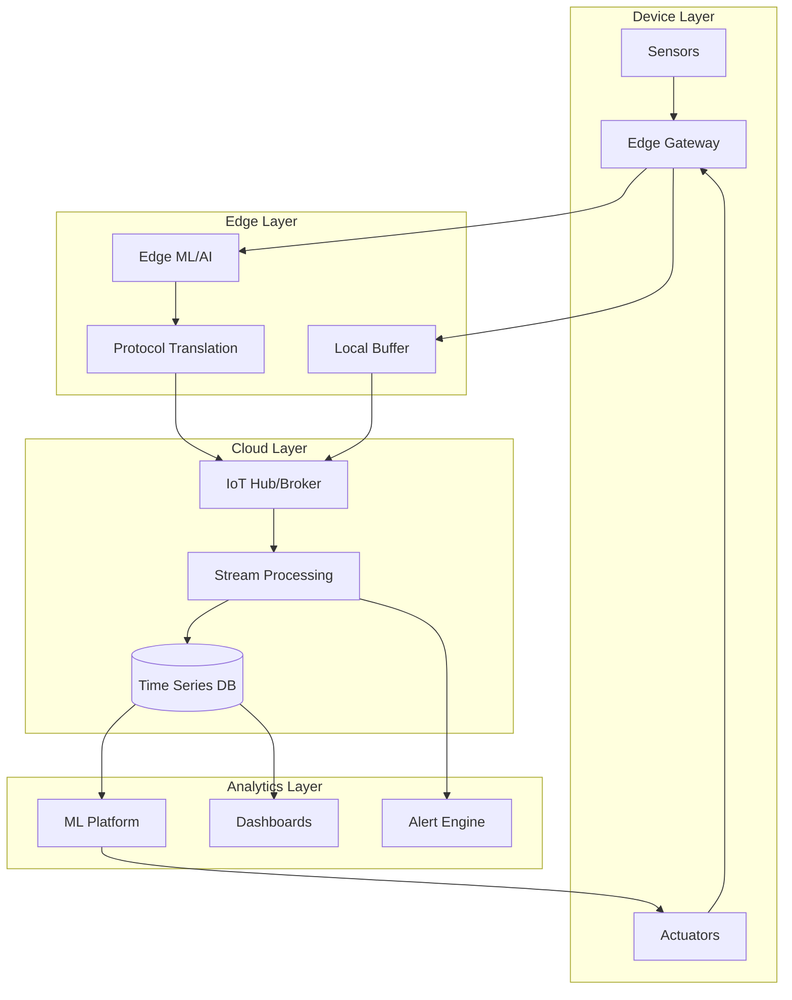

# IoT Architecture Designer

## Description

Designs IoT system architectures for industrial, smart city, healthcare, and agricultural applications. Provides strategies for device connectivity, edge processing, cloud ingestion, analytics, and security while addressing scale, intermittent connectivity, and regulatory compliance.

## Architecture Diagram



## Use Cases

- Designing industrial IoT (IIoT) for manufacturing predictive maintenance
- Building smart building/city sensor networks
- Creating connected vehicle fleet management systems
- Implementing agricultural IoT for precision farming
- Designing healthcare wearable monitoring platforms
- Building retail smart shelf and inventory systems

## Variables

- `[use_case]`: IoT use case (e.g., "Cold chain monitoring for pharmaceutical distribution")
- `[devices]`: Device types (e.g., "Temperature/humidity sensors, GPS trackers, Edge gateways")
- `[data_volume]`: Data volume (e.g., "50,000 sensors, 1 reading/minute = 72M data points/day")
- `[connectivity]`: Connectivity (e.g., "LoRaWAN for sensors, LTE for gateways, intermittent connectivity")
- `[security]`: Security requirements (e.g., "FDA 21 CFR Part 11 compliance, data integrity assurance")

## Example

### Context
A food manufacturer needs to monitor 500 cold storage facilities for FDA compliance.

### Input

```text
Use Case: Cold chain monitoring for FDA compliance (FSMA)
Device Types: Temperature sensors (5 per facility), humidity, door sensors
Data Volume: 500 facilities × 7 sensors × 1 reading/minute = 5M readings/day
Connectivity: Cellular (4G/LTE) with occasional connectivity drops
Security Requirements: Device authentication, encrypted transport, audit trail
```

### Expected Output

- **Device Architecture**: LoRaWAN sensors → Edge gateway with 4G backhaul
- **Edge Processing**: Local anomaly detection, offline buffering
- **Cloud Ingestion**: AWS IoT Core with device shadows for state sync
- **Analytics**: Real-time alerting, daily compliance reports
- **Security**: X.509 certificates at manufacturing, mutual TLS

## Related Prompts

- [Security Architecture Specialist](security-architecture-specialist.md) - For IoT security controls
- [Data Architecture Designer](data-architecture-designer.md) - For time series data management
- [Cloud Architecture Consultant](cloud-architecture-consultant.md) - For cloud IoT platform selection
- [Enterprise Integration Architect](enterprise-integration-architect.md) - For IT/OT integration
- [Blockchain Architecture Specialist](blockchain-architecture-specialist.md) - For IoT supply chain traceability
