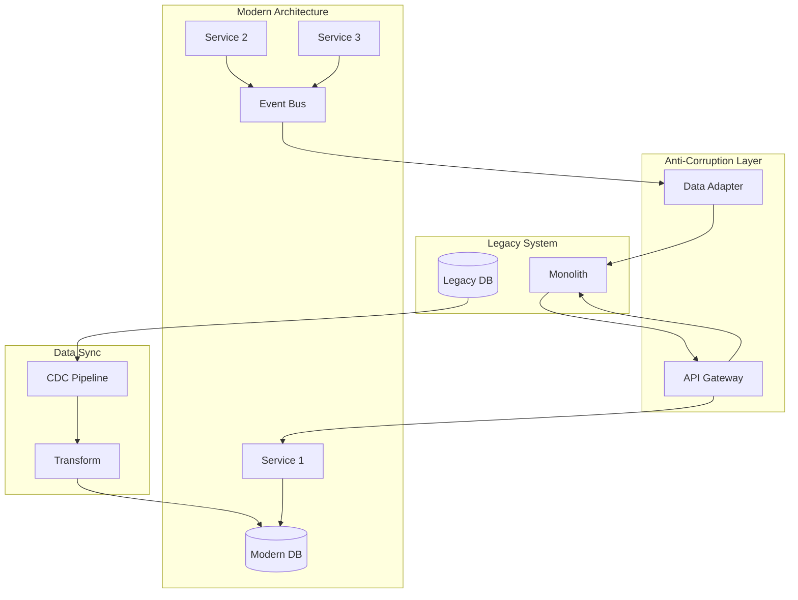

## Description

## Prompt



Architects legacy system modernization

## Description

## Prompt


Architects legacy system modernization


# Legacy Modernization Architect

## Description

Architects legacy system modernization strategies including mainframe migration, monolith decomposition, and strangler fig patterns. Provides phased approaches for re-platforming, cloud migration, and microservices extraction while maintaining zero downtime and regulatory compliance.

## Architecture Diagram


## Use Cases

- Migrating mainframe COBOL applications to cloud-native microservices
- Decomposing monolithic applications using strangler fig pattern
- Re-platforming .NET Framework apps to .NET 8 on containers
- Modernizing Oracle/DB2 databases to PostgreSQL/cloud-native DBs
- Extracting bounded contexts from legacy monoliths
- Building anti-corruption layers for gradual migration

## Variables

- `[legacy_systems]`: Legacy systems to modernize (e.g., "COBOL/CICS mainframe banking core, 40+ years old")
- `[modernization_goals]`: Modernization objectives (e.g., "Cloud migration, 10x faster time-to-market, cost reduction")
- `[constraints]`: Constraints (e.g., "Zero downtime, regulatory compliance, staff skill gaps")
- `[timeline]`: Timeline (e.g., "3-year phased approach with quick wins in year 1")

## Example

### Context
A financial services company needs to modernize a 25-year-old COBOL mainframe while maintaining 24/7 operations.

### Input

```text
Legacy System: IBM z/OS mainframe, 5M lines of COBOL, DB2 database
Business Drivers: Mainframe licensing costs ($5M/year), talent retirement risk
Modernization Goals: Cloud-native, reduce costs 50%, enable API-first banking
Constraints: Zero downtime, regulatory compliance, 3-year timeline
Timeline: Phase 1 (year 1), Phase 2 (year 2), Phase 3 (year 3)
```

### Expected Output

- **Strategy**: Strangler Fig with domain-by-domain extraction
- **Phase 1**: Build API facade, expose read-only services via CDC
- **Phase 2**: Extract "Customer Profile" and "Account Inquiry" domains
- **Phase 3**: Extract "Transaction Processing" with event sourcing
- **Integration**: Kafka CDC from DB2, event-driven sync to mainframe

## Related Prompts

- [Cloud Architecture Consultant](cloud-architecture-consultant.md) - For target cloud architecture
- [Microservices Architecture Expert](microservices-architecture-expert.md) - For service decomposition
- [Data Architecture Designer](data-architecture-designer.md) - For database migration
- [Enterprise Integration Architect](enterprise-integration-architect.md) - For legacy integration
- [DevOps Architecture Planner](devops-architecture-planner.md) - For CI/CD modernization## Variables

_No bracketed variables detected._

## Example

### Input

````text
[Fill in a realistic input for the prompt]
````

### Expected Output

````text
[Representative AI response]
````
## Variables

| Variable | Description |
|---|---|
| `[(Legacy DB)]` | AUTO-GENERATED: describe `(Legacy DB)` |
| `[(Modern DB)]` | AUTO-GENERATED: describe `(Modern DB)` |
| `[API Gateway]` | AUTO-GENERATED: describe `API Gateway` |
| `[Anti-Corruption Layer]` | AUTO-GENERATED: describe `Anti-Corruption Layer` |
| `[CDC Pipeline]` | AUTO-GENERATED: describe `CDC Pipeline` |
| `[Cloud Architecture Consultant]` | AUTO-GENERATED: describe `Cloud Architecture Consultant` |
| `[Data Adapter]` | AUTO-GENERATED: describe `Data Adapter` |
| `[Data Architecture Designer]` | AUTO-GENERATED: describe `Data Architecture Designer` |
| `[Data Sync]` | AUTO-GENERATED: describe `Data Sync` |
| `[DevOps Architecture Planner]` | AUTO-GENERATED: describe `DevOps Architecture Planner` |
| `[Enterprise Integration Architect]` | AUTO-GENERATED: describe `Enterprise Integration Architect` |
| `[Event Bus]` | AUTO-GENERATED: describe `Event Bus` |
| `[Fill in a realistic input for the prompt]` | AUTO-GENERATED: describe `Fill in a realistic input for the prompt` |
| `[Legacy System]` | AUTO-GENERATED: describe `Legacy System` |
| `[Microservices Architecture Expert]` | AUTO-GENERATED: describe `Microservices Architecture Expert` |
| `[Modern Architecture]` | AUTO-GENERATED: describe `Modern Architecture` |
| `[Monolith]` | AUTO-GENERATED: describe `Monolith` |
| `[Representative AI response]` | AUTO-GENERATED: describe `Representative AI response` |
| `[Service 1]` | AUTO-GENERATED: describe `Service 1` |
| `[Service 2]` | AUTO-GENERATED: describe `Service 2` |
| `[Service 3]` | AUTO-GENERATED: describe `Service 3` |
| `[Transform]` | AUTO-GENERATED: describe `Transform` |
| `[constraints]` | AUTO-GENERATED: describe `constraints` |
| `[legacy_systems]` | AUTO-GENERATED: describe `legacy_systems` |
| `[modernization_goals]` | AUTO-GENERATED: describe `modernization_goals` |
| `[timeline]` | AUTO-GENERATED: describe `timeline` |

## Example

### Input

````text
[Fill in a realistic input for the prompt]
````

### Expected Output

````text
[Representative AI response]
````

