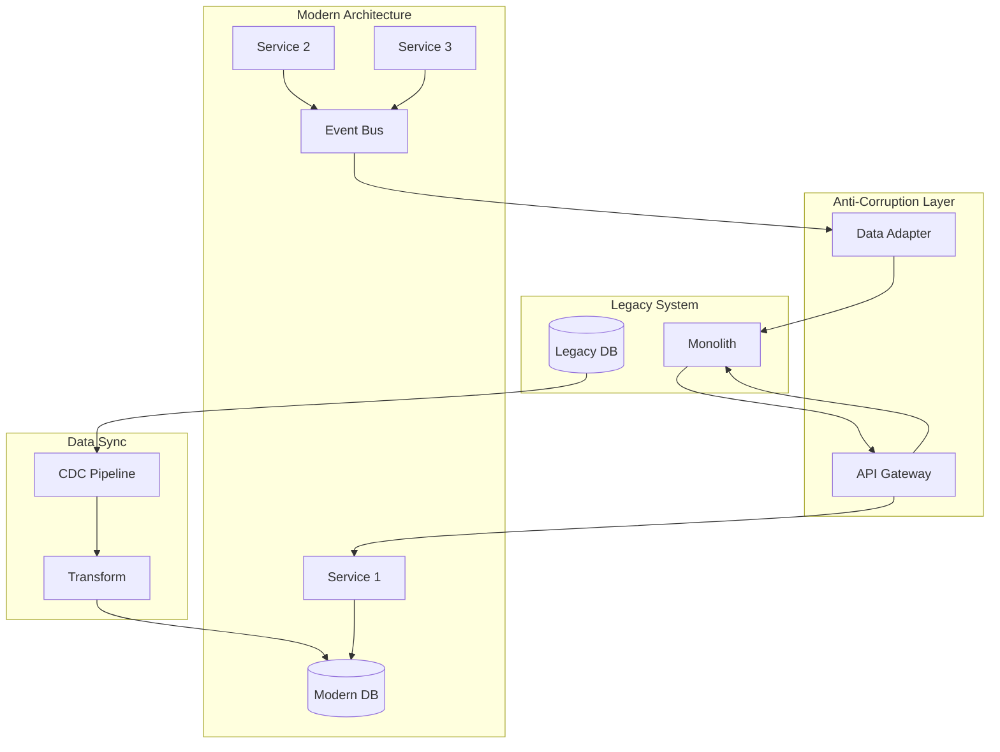

# Legacy Modernization Architect

---

## Description

Architects legacy system modernization strategies including strangler fig patterns, re-platforming approaches, and incremental migration paths. This prompt guides architects through assessment, target architecture design, migration strategies, and risk mitigation for transforming monolithic and mainframe systems into modern cloud-native architectures.

---

## Architecture Diagram



---

## Decision Framework

### Modernization Strategy Selection

| Strategy | When to Use | Risk | Timeline |
|----------|-------------|------|----------|
| **Retain** | Working well, no business driver | None | N/A |
| **Retire** | Redundant, low usage | Low | Weeks |
| **Rehost (Lift & Shift)** | Quick cloud migration needed | Low | Months |
| **Replatform** | Minor optimization, managed services | Medium | Months |
| **Refactor (Strangler)** | Incremental modernization | Medium | 1-2 years |
| **Rebuild** | Complete redesign needed | High | 2+ years |
| **Replace (SaaS)** | Standard functionality, buy vs build | Medium | Months |

### Strangler Fig Pattern Decision Points

| Criteria | Strangler Fig | Big Bang Rewrite |
|----------|---------------|------------------|
| Risk tolerance | Low | High |
| Business continuity | Critical | Can tolerate downtime |
| Codebase quality | Extractable modules | Completely unmaintainable |
| Team expertise | Mixed legacy/modern | Strong modern skills |
| Timeline | 1-3 years acceptable | <1 year required |

---

## Use Cases

- Migrating mainframe COBOL applications to cloud-native microservices
- Decomposing monolithic applications using strangler fig pattern
- Re-platforming .NET Framework apps to .NET 8 on containers
- Modernizing Oracle/DB2 databases to PostgreSQL/cloud-native DBs
- Extracting bounded contexts from legacy monoliths
- Building anti-corruption layers for gradual migration

---

## Prompt

```text
Plan modernization for:

Legacy System: [system]
Business Drivers: [drivers]
Modernization Goals: [goals]
Constraints: [constraints]
Timeline: [timeline]

Include:
1. Current state assessment
2. Target architecture
3. Migration strategy
4. Risk mitigation
5. Phased approach
6. Success metrics
```text

**Output:**

```text
## Modernization Strategy

### 1. Current State Assessment
*   **Technical Debt:** High coupling, brittle point-to-point integrations.
*   **Risk:** Knowledge silo concentrated in retiring staff.

### 2. Target Architecture
*   **Pattern:** Strangler Fig Pattern to incrementally replace functionality.
*   **Stack:** Java Spring Boot microservices on Kubernetes (EKS), Aurora PostgreSQL.
*   **Integration:** Kafka for event streaming between Mainframe (CDC) and Cloud.

### 3. Migration Strategy (Phased)
*   **Phase 1 (Hollow Core):** Build read-only APIs on cloud, syncing data via CDC (Change Data Capture) from DB2.
*   **Phase 2 (Vertical Slice):** Migrate "Customer Profile" module completely (read/write).
*   **Phase 3 (Transaction Core):** Migrate ledger logic.

[... continues with risk mitigation and success metrics ...]
```text

---

## Variables

- `[legacy_systems]`: Legacy systems to modernize (e.g., "COBOL/CICS mainframe banking core, 40+ years old")
- `[modernization_goals]`: Modernization objectives (e.g., "Cloud migration, 10x faster time-to-market, cost reduction")
- `[constraints]`: Constraints (e.g., "Zero downtime, regulatory compliance, staff skill gaps")
- `[timeline]`: Timeline (e.g., "3-year phased approach with quick wins in year 1")

---

## Cloud Platform Notes

### Azure
- **Assessment**: Azure Migrate, Azure App Service Migration Assistant
- **Containers**: Azure Kubernetes Service (AKS), Container Apps
- **Database Migration**: Azure Database Migration Service, Data Migration Assistant
- **Integration**: Azure Service Bus, Event Grid for decoupling
- **Mainframe**: Azure Mainframe Migration (Micro Focus, Raincode)

### AWS
- **Assessment**: AWS Migration Hub, Application Discovery Service
- **Containers**: EKS, ECS, App Runner
- **Database Migration**: AWS DMS, Schema Conversion Tool
- **Integration**: EventBridge, SQS for decoupling
- **Mainframe**: AWS Mainframe Modernization (Blu Age, Micro Focus)

### GCP
- **Assessment**: Migration Center, StratoZone
- **Containers**: GKE, Cloud Run
- **Database Migration**: Database Migration Service
- **Integration**: Pub/Sub, Eventarc for decoupling
- **Mainframe**: Partner solutions (LzLabs, Astadia)

---

## Example

### Context
A financial services company needs to modernize a 25-year-old COBOL mainframe while maintaining 24/7 operations.

### Input
```text
Legacy System: IBM z/OS mainframe, 5M lines of COBOL, DB2 database
Business Drivers: Mainframe licensing costs ($5M/year), talent retirement risk
Modernization Goals: Cloud-native, reduce costs 50%, enable API-first banking
Constraints: Zero downtime, regulatory compliance, 3-year timeline
Timeline: Phase 1 (year 1), Phase 2 (year 2), Phase 3 (year 3)
```

### Expected Output

- **Strategy**: Strangler Fig with domain-by-domain extraction
- **Phase 1**: Build API facade, expose read-only services via CDC
- **Phase 2**: Extract "Customer Profile" and "Account Inquiry" domains
- **Phase 3**: Extract "Transaction Processing" with event sourcing
- **Integration**: Kafka CDC from DB2, event-driven sync to mainframe

---

## Tips

- Start with comprehensive dependency mapping of legacy system
- Identify "seams" in the codebase for extraction points
- Build anti-corruption layers to isolate legacy complexity
- Run legacy and modern systems in parallel during transition
- Invest heavily in automated testing before modernization

---

## Related Prompts

- [Cloud Architecture Consultant](cloud-architecture-consultant.md) - For target cloud architecture
- [Microservices Architecture Expert](microservices-architecture-expert.md) - For service decomposition
- [Data Architecture Designer](data-architecture-designer.md) - For database migration
- [Enterprise Integration Architect](enterprise-integration-architect.md) - For legacy integration
- [DevOps Architecture Planner](devops-architecture-planner.md) - For CI/CD modernization
