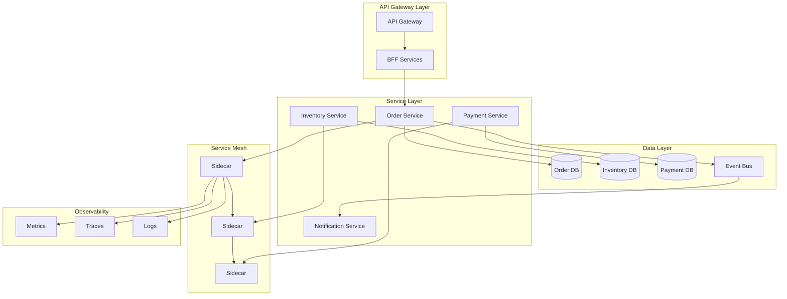

# Microservices Architecture Expert

## Description

Designs microservices ecosystems with domain-driven design, service mesh, event-driven communication, and distributed observability. Provides strategies for service decomposition, inter-service communication, data management, and deployment patterns while optimizing for team autonomy and system resilience.

## Architecture Diagram



## Use Cases

- Decomposing monoliths into domain-driven bounded contexts
- Designing event-driven microservices with Kafka/RabbitMQ
- Implementing service mesh patterns with Istio/Linkerd
- Building GraphQL federation for microservices aggregation
- Creating saga patterns for distributed transactions
- Establishing observability for distributed tracing

## Variables

- `[domain]`: Business domain (e.g., "Last-mile logistics and delivery platform")
- `[services]`: Key services or domains (e.g., "Order management, Routing, Fleet operations, Billing")
- `[scale]`: Scale requirements (e.g., "500K daily orders, 10K concurrent drivers")
- `[team_structure]`: Team structure (e.g., "4 product teams aligned to business domains")

## Example

### Context
A logistics company needs to redesign their monolithic tracking system into microservices.

### Input

```text
Domain: Last-mile logistics with real-time tracking
Business Capabilities: Shipment management, route optimization, driver management
Scale Requirements: 1M daily shipments, 50k concurrent tracking requests
Team Structure: 6 squads, each owns 2-3 services
```

### Expected Output

- **Bounded Contexts**: Shipment, Routing, Fleet, Commerce, Notification
- **Communication**: gRPC for internal sync, Kafka for domain events
- **Data Management**: Database per service, event sourcing for state
- **Service Mesh**: Istio for mTLS, traffic management
- **Deployment**: GitOps with ArgoCD, canary deployments

## Related Prompts

- [API Architecture Designer](api-architecture-designer.md) - For API design between services
- [DevOps Architecture Planner](devops-architecture-planner.md) - For microservices CI/CD
- [Data Architecture Designer](data-architecture-designer.md) - For polyglot persistence
- [Performance Architecture Optimizer](performance-architecture-optimizer.md) - For service performance
- [Cloud Architecture Consultant](cloud-architecture-consultant.md) - For container platform selection
