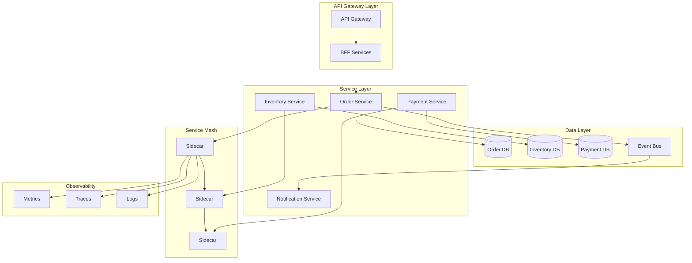

# Microservices Architecture Expert

---

## Description

Designs microservices ecosystems using domain-driven design principles, including service decomposition, communication patterns, data management strategies, and observability frameworks. This prompt guides architects through bounded context identification, API contracts, and deployment patterns for distributed systems.

---

## Architecture Diagram



---

## Decision Framework

### When to Use Microservices

| Criteria | Microservices | Monolith |
|----------|---------------|----------|
| Team size | 50+ developers | <20 developers |
| Deployment frequency | Multiple/day per service | Weekly/monthly |
| Scale requirements | Varies by component | Uniform scaling |
| Technology diversity | Polyglot beneficial | Single stack preferred |
| Organizational structure | Multiple autonomous teams | Single team |

### Communication Pattern Selection

| Pattern | When to Use | Trade-offs |
|---------|-------------|------------|
| **Sync REST/gRPC** | Query responses, low latency needed | Tight coupling, cascading failures |
| **Async Messaging** | Fire-and-forget, eventual consistency OK | Message broker dependency |
| **Event-Driven** | Loose coupling, event sourcing | Eventual consistency, debugging complexity |
| **Saga** | Distributed transactions | Compensation logic complexity |
| **CQRS** | Read/write optimization, event sourcing | Data duplication, sync complexity |

---

## Use Cases

- Decomposing monoliths into domain-driven bounded contexts
- Designing event-driven microservices with Kafka/RabbitMQ
- Implementing service mesh patterns with Istio/Linkerd
- Building GraphQL federation for microservices aggregation
- Creating saga patterns for distributed transactions
- Establishing observability for distributed tracing

---

## Prompt

```text
Design microservices architecture for:

Domain: [domain]
Business Capabilities: [capabilities]
Scale Requirements: [scale]
Team Structure: [teams]

Include:
1. Service decomposition
2. Communication patterns
3. Data management
4. Service mesh design
5. Observability strategy
6. Deployment architecture
```text

**Output:**

```text
## Microservices Architecture Design

### 1. Service Decomposition (Domain-Driven Design)

**Bounded Contexts:**
*   **Logistics Core:**
    *   `Shipment Service` (Lifecycle of a package)
    *   `Routing Service` (Graph algorithms for pathfinding)
*   **Fleet Operations:**
    *   `Vehicle Telemetry Service` (IoT stream ingestion)
    *   `Driver Service` (Shifts, compliance)
*   **Commerce:**
    *   `Billing Service` (Invoicing)
    *   `Payroll Service` (Driver compensation)

### 2. Communication Patterns
*   **Synchronous (Internal):** gRPC for high-performance inter-service communication (e.g., Routing -> Telemetry).
*   **Asynchronous (Event-Driven):** Kafka for domain events (e.g., `PackageDelivered` event triggers `Billing` and `Notification`).
*   **External:** GraphQL Gateway for mobile apps and web dashboard.

[... continues with data management and service mesh ...]
```text

---

## Variables

- `[domain]`: Business domain (e.g., "Last-mile logistics and delivery platform")
- `[services]`: Key services or domains (e.g., "Order management, Routing, Fleet operations, Billing")
- `[scale]`: Scale requirements (e.g., "500K daily orders, 10K concurrent drivers")
- `[team_structure]`: Team structure (e.g., "4 product teams aligned to business domains")

---

## Cloud Platform Notes

### Azure
- **Container Platform**: Azure Kubernetes Service (AKS), Container Apps
- **Service Mesh**: Azure Service Mesh (Istio-based), Dapr
- **API Gateway**: Azure API Management, Azure Application Gateway
- **Messaging**: Azure Service Bus, Event Hubs, Event Grid
- **Observability**: Azure Monitor, Application Insights, Log Analytics

### AWS
- **Container Platform**: EKS, ECS, App Mesh
- **Service Mesh**: AWS App Mesh, Istio on EKS
- **API Gateway**: Amazon API Gateway, AppSync
- **Messaging**: SQS, SNS, EventBridge, MSK (Kafka)
- **Observability**: CloudWatch, X-Ray, OpenSearch

### GCP
- **Container Platform**: GKE, Cloud Run
- **Service Mesh**: Anthos Service Mesh (Istio-based)
- **API Gateway**: Apigee, Cloud Endpoints
- **Messaging**: Pub/Sub, Eventarc
- **Observability**: Cloud Monitoring, Cloud Trace, Cloud Logging

---

## Example

### Context
A logistics company needs to redesign their monolithic tracking system into microservices.

### Input
```text
Domain: Last-mile logistics with real-time tracking
Business Capabilities: Shipment management, route optimization, driver management
Scale Requirements: 1M daily shipments, 50k concurrent tracking requests
Team Structure: 6 squads, each owns 2-3 services
```

### Expected Output

- **Bounded Contexts**: Shipment, Routing, Fleet, Commerce, Notification
- **Communication**: gRPC for internal sync, Kafka for domain events
- **Data Management**: Database per service, event sourcing for state
- **Service Mesh**: Istio for mTLS, traffic management
- **Deployment**: GitOps with ArgoCD, canary deployments

---

## Tips

- Start with strategic DDD to identify bounded contexts
- Avoid distributed monolith anti-pattern
- Use async communication where possible
- Implement circuit breakers at service boundaries
- Invest in observability before splitting services

---

## Related Prompts

- [API Architecture Designer](api-architecture-designer.md) - For API design between services
- [DevOps Architecture Planner](devops-architecture-planner.md) - For microservices CI/CD
- [Data Architecture Designer](data-architecture-designer.md) - For polyglot persistence
- [Performance Architecture Optimizer](performance-architecture-optimizer.md) - For service performance
- [Cloud Architecture Consultant](cloud-architecture-consultant.md) - For container platform selection
