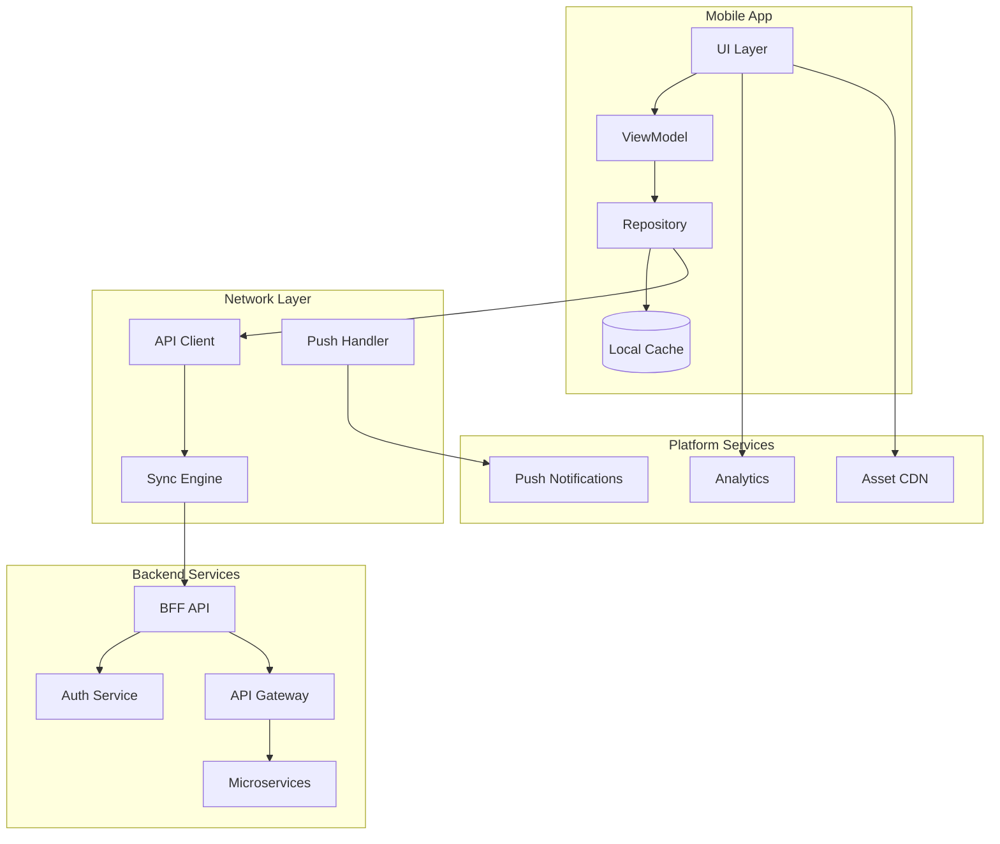

# Mobile Architecture Consultant

---

## Description

Designs mobile application architectures for iOS, Android, and cross-platform solutions. This prompt guides architects through framework selection, offline-first patterns, backend integration strategies, and mobile-specific security implementations for consumer and enterprise apps.

---

## Architecture Diagram



---

## Decision Framework

### Framework Selection

| Framework | When to Use | Trade-offs |
| ----------- | ------------- | ------------ |
| **Native (Swift/Kotlin)** | Performance critical, platform-specific features | Two codebases, higher cost |
| **React Native** | Web team, code sharing with web | Bridge overhead, native module needs |
| **Flutter** | Consistent UI, single codebase | Dart ecosystem, large app size |
| **Kotlin Multiplatform** | Shared business logic, native UI | Maturing ecosystem |
| **PWA** | Wide reach, simple requirements | Limited device access |

### Offline Strategy Decision

| Strategy | When to Use | Complexity |
| ---------- | ------------- | ------------ |
| **Cache-first** | Read-heavy, stale data acceptable | Low |
| **Network-first** | Fresh data important | Low |
| **Offline-first** | Unreliable connectivity, field work | High |
| **Background sync** | Eventual consistency acceptable | Medium |

---

## Use Cases

- Designing offline-first mobile apps for field workers
- Building cross-platform apps with shared business logic
- Creating secure mobile banking and payment apps
- Implementing mobile-backend-for-frontend (BFF) patterns
- Designing push notification architectures for engagement
- Building healthcare apps with HIPAA compliance

---

## Prompt

```text
Design mobile architecture for:

App Type: [app_type]
Target Platforms: [platforms]
User Base: [users]
Performance Requirements: [performance]
Security Needs: [security]

Include:

1. Architecture patterns
2. Backend integration
3. Offline capabilities
4. Security implementation
5. Performance optimization
6. Testing strategy

```text

**Output:**

```text
## Mobile Architecture Design

### 1. Architecture Pattern

*   **MVVM-C (Model-View-ViewModel + Coordinator):**
    *   Decouples UI from business logic for testability.
    *   Coordinators handle navigation flow, enabling deep linking support.
*   **Modularization:** Feature-based modules (Auth, Appointments, VideoCall, Prescriptions) to speed up build times.

### 2. Backend Integration

*   **Protocol:** GraphQL (Apollo Client) to minimize over-fetching on mobile networks.
*   **Real-time:** WebSockets for chat and appointment status updates.
*   **Resilience:** Circuit breaker pattern for flaky network conditions.

### 3. Offline Capabilities

*   **Strategy:** "Offline-First" for read-only data (Prescription history).
*   **Storage:** Encrypted Realm/Room database.
*   **Sync:** Background sync worker to upload vitals when connectivity restores.

[... continues with security implementation and testing ...]
```text

---

## Variables

- `[app_type]`: Application type (e.g., "Telehealth platform for patient-doctor consultations")
- `[platforms]`: Target platforms (e.g., "iOS (iPhone/iPad), Android, companion web app")
- `[features]`: Key features (e.g., "Video consultations, prescription management, vitals tracking")
- `[performance]`: Performance requirements (e.g., "< 3s cold start, offline-capable, low battery usage")
- `[security]`: Security requirements (e.g., "HIPAA compliance, end-to-end encryption, biometric auth")

---

## Cloud Platform Notes

### Azure

- **Backend**: Azure App Service, Azure Functions, Container Apps
- **BFF**: Azure API Management with mobile-optimized policies
- **Push**: Azure Notification Hubs (multi-platform)
- **Auth**: Azure AD B2C, MSAL libraries for mobile
- **Analytics**: Azure Application Insights, App Center

### AWS

- **Backend**: API Gateway, Lambda, AppSync (GraphQL)
- **BFF**: API Gateway with caching, AWS Amplify
- **Push**: Amazon SNS, Pinpoint for targeted messaging
- **Auth**: Amazon Cognito, Amplify Auth
- **Analytics**: Pinpoint, CloudWatch

### GCP

- **Backend**: Cloud Run, Cloud Functions, Firebase
- **BFF**: Apigee, Cloud Endpoints
- **Push**: Firebase Cloud Messaging (FCM)
- **Auth**: Firebase Auth, Identity Platform
- **Analytics**: Firebase Analytics, BigQuery

---

## Example

### Context
A healthcare startup needs a telemedicine app with video consultations and secure messaging.

### Input

```text
App Type: Telemedicine platform with video, chat, prescriptions
Target Platforms: iOS (14+), Android (10+)
User Base: 500k patients, 10k doctors, 100k concurrent during peak
Performance Requirements: Video call connect <3s, message delivery <1s
Security Needs: HIPAA compliance, biometric auth, encrypted local storage
```

### Expected Output

- **Framework**: Native (Swift/Kotlin) for HealthKit/Google Fit integration
- **Architecture**: MVVM-C with Coordinators for navigation
- **Backend**: GraphQL BFF with WebSocket for real-time
- **Offline**: Encrypted Realm/Room for message history
- **Security**: Certificate pinning, biometric unlock, FHIR-compliant data

---

## Tips

- Design for the worst network conditions (2G, high latency)
- Implement proper state restoration for backgrounded apps
- Use feature flags for gradual rollouts and A/B testing
- Plan for app store review requirements and guidelines
- Test on real devices, not just simulators

---

## Related Prompts

- [API Architecture Designer](api-architecture-designer.md) - For mobile BFF APIs
- [Security Architecture Specialist](security-architecture-specialist.md) - For mobile security controls
- [Performance Architecture Optimizer](performance-architecture-optimizer.md) - For mobile performance
- [Cloud Architecture Consultant](cloud-architecture-consultant.md) - For mobile backend services
- [IoT Architecture Designer](iot-architecture-designer.md) - For wearable integrations
