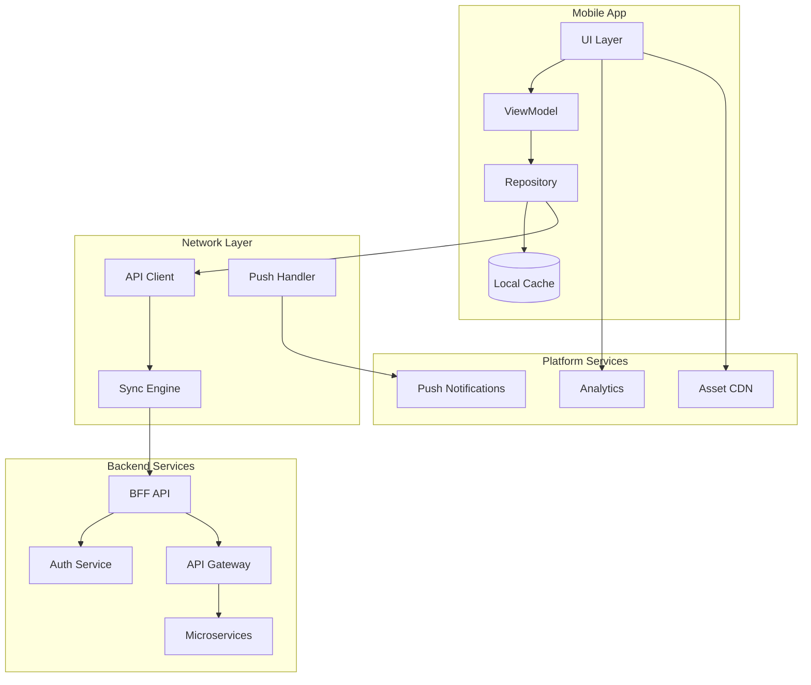

## Description

## Prompt



Designs mobile application architectures

## Description

## Prompt


Designs mobile application architectures


# Mobile Architecture Consultant

## Description

Designs mobile application architectures for iOS, Android, and cross-platform development. Provides strategies for offline-first design, backend-for-frontend patterns, push notifications, and mobile security while addressing performance, compliance, and platform-specific requirements.

## Architecture Diagram


## Use Cases

- Designing offline-first mobile apps for field workers
- Building cross-platform apps with shared business logic
- Creating secure mobile banking and payment apps
- Implementing mobile-backend-for-frontend (BFF) patterns
- Designing push notification architectures for engagement
- Building healthcare apps with HIPAA compliance

## Variables

- `[app_type]`: Application type (e.g., "Telehealth platform for patient-doctor consultations")
- `[platforms]`: Target platforms (e.g., "iOS (iPhone/iPad), Android, companion web app")
- `[features]`: Key features (e.g., "Video consultations, prescription management, vitals tracking")
- `[performance]`: Performance requirements (e.g., "< 3s cold start, offline-capable, low battery usage")
- `[security]`: Security requirements (e.g., "HIPAA compliance, end-to-end encryption, biometric auth")

## Example

### Context
A healthcare startup needs a telemedicine app with video consultations and secure messaging.

### Input

```text
App Type: Telemedicine platform with video, chat, prescriptions
Target Platforms: iOS (14+), Android (10+)
User Base: 500k patients, 10k doctors, 100k concurrent during peak
Performance Requirements: Video call connect <3s, message delivery <1s
Security Needs: HIPAA compliance, biometric auth, encrypted local storage
```

### Expected Output

- **Framework**: Native (Swift/Kotlin) for HealthKit/Google Fit integration
- **Architecture**: MVVM-C with Coordinators for navigation
- **Backend**: GraphQL BFF with WebSocket for real-time
- **Offline**: Encrypted Realm/Room for message history
- **Security**: Certificate pinning, biometric unlock, FHIR-compliant data

## Related Prompts

- [API Architecture Designer](api-architecture-designer.md) - For mobile BFF APIs
- [Security Architecture Specialist](security-architecture-specialist.md) - For mobile security controls
- [Performance Architecture Optimizer](performance-architecture-optimizer.md) - For mobile performance
- [Cloud Architecture Consultant](cloud-architecture-consultant.md) - For mobile backend services
- [IoT Architecture Designer](iot-architecture-designer.md) - For wearable integrations## Variables

| Variable | Description |
|---|---|
| `[BFF API]` | AUTO-GENERATED: describe `BFF API` |

## Example

### Input

````text
[Fill in a realistic input for the prompt]
````

### Expected Output

````text
[Representative AI response]
````
## Variables

| Variable | Description |
|---|---|
| `[(Local Cache)]` | AUTO-GENERATED: describe `(Local Cache)` |
| `[API Architecture Designer]` | AUTO-GENERATED: describe `API Architecture Designer` |
| `[API Client]` | AUTO-GENERATED: describe `API Client` |
| `[API Gateway]` | AUTO-GENERATED: describe `API Gateway` |
| `[Analytics]` | AUTO-GENERATED: describe `Analytics` |
| `[Asset CDN]` | AUTO-GENERATED: describe `Asset CDN` |
| `[Auth Service]` | AUTO-GENERATED: describe `Auth Service` |
| `[BFF API]` | AUTO-GENERATED: describe `BFF API` |
| `[Backend Services]` | AUTO-GENERATED: describe `Backend Services` |
| `[Cloud Architecture Consultant]` | AUTO-GENERATED: describe `Cloud Architecture Consultant` |
| `[Fill in a realistic input for the prompt]` | AUTO-GENERATED: describe `Fill in a realistic input for the prompt` |
| `[IoT Architecture Designer]` | AUTO-GENERATED: describe `IoT Architecture Designer` |
| `[Microservices]` | AUTO-GENERATED: describe `Microservices` |
| `[Mobile App]` | AUTO-GENERATED: describe `Mobile App` |
| `[Network Layer]` | AUTO-GENERATED: describe `Network Layer` |
| `[Performance Architecture Optimizer]` | AUTO-GENERATED: describe `Performance Architecture Optimizer` |
| `[Platform Services]` | AUTO-GENERATED: describe `Platform Services` |
| `[Push Handler]` | AUTO-GENERATED: describe `Push Handler` |
| `[Push Notifications]` | AUTO-GENERATED: describe `Push Notifications` |
| `[Repository]` | AUTO-GENERATED: describe `Repository` |
| `[Representative AI response]` | AUTO-GENERATED: describe `Representative AI response` |
| `[Security Architecture Specialist]` | AUTO-GENERATED: describe `Security Architecture Specialist` |
| `[Sync Engine]` | AUTO-GENERATED: describe `Sync Engine` |
| `[UI Layer]` | AUTO-GENERATED: describe `UI Layer` |
| `[ViewModel]` | AUTO-GENERATED: describe `ViewModel` |
| `[app_type]` | AUTO-GENERATED: describe `app_type` |
| `[features]` | AUTO-GENERATED: describe `features` |
| `[performance]` | AUTO-GENERATED: describe `performance` |
| `[platforms]` | AUTO-GENERATED: describe `platforms` |
| `[security]` | AUTO-GENERATED: describe `security` |

## Example

### Input

````text
[Fill in a realistic input for the prompt]
````

### Expected Output

````text
[Representative AI response]
````

