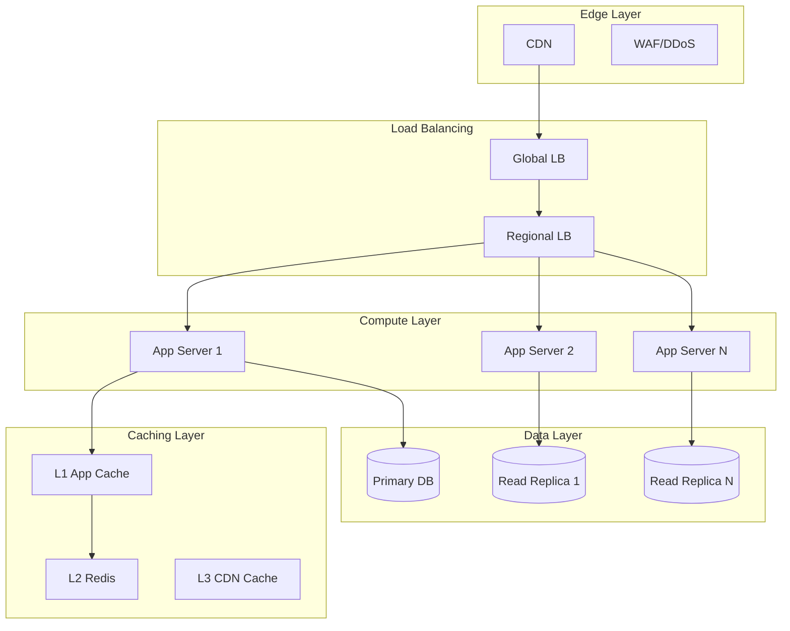

# Performance Architecture Optimizer

## Description

Optimizes system performance through caching strategies, load balancing, database tuning, and auto-scaling. Provides recommendations for reducing latency, improving throughput, and cost optimization while meeting SLA requirements and handling peak traffic scenarios.

## Architecture Diagram



## Use Cases

- Optimizing high-traffic e-commerce platforms for Black Friday scale
- Reducing database latency through caching and read replicas
- Designing auto-scaling strategies for variable workloads
- Implementing CDN strategies for global content delivery
- Performance tuning microservices communication patterns
- Creating performance testing and benchmarking frameworks

## Variables

- `[system_name]`: System name (e.g., "Global e-commerce platform checkout service")
- `[issues]`: Current performance issues (e.g., "P99 latency 5s during peak, 30% checkout abandonment")
- `[load]`: Expected load (e.g., "100K concurrent users during flash sales, 10x normal traffic")
- `[targets]`: Performance targets (e.g., "P99 < 500ms, 99.99% availability, support 5x current scale")
- `[budget]`: Budget constraints (e.g., "$200K for infrastructure optimization")

## Example

### Context
A video streaming platform experiencing 5-second latency during live events.

### Input

```text
System: Global Video Streaming Platform (10M concurrent viewers)
Performance Issues: High latency during live events (p99 > 5s), database CPU at 100%
Target Metrics: p99 latency < 500ms, 99.99% availability, 20% cost reduction
User Load: 500k requests/sec peak, 10PB data transfer/month
Budget Constraints: $200k/month cloud spend limit
```

### Expected Output

- **CDN**: Multi-CDN strategy with DNS-based selection
- **Caching**: Redis cluster with cache-aside pattern, cache warming
- **Database**: Read replicas with connection pooling, query optimization
- **Scaling**: Predictive auto-scaling based on event schedule
- **Monitoring**: Real-time dashboards with p50/p95/p99 latency tracking

## Related Prompts

- [Cloud Architecture Consultant](cloud-architecture-consultant.md) - For scalable cloud architecture
- [Data Architecture Designer](data-architecture-designer.md) - For database optimization
- [Microservices Architecture Expert](microservices-architecture-expert.md) - For service performance
- [DevOps Architecture Planner](devops-architecture-planner.md) - For performance testing in CI/CD
- [Disaster Recovery Architect](disaster-recovery-architect.md) - For high availability design
