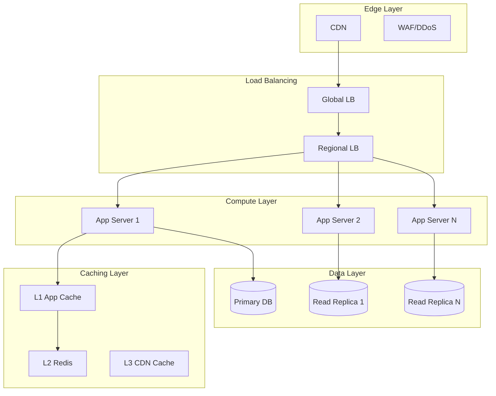

# Performance Architecture Optimizer

---

## Description

Optimizes system performance architecture through bottleneck analysis, caching strategies, and scalability improvements. This prompt guides architects through load analysis, latency optimization, capacity planning, and performance monitoring frameworks for high-throughput systems.

---

## Architecture Diagram



---

## Decision Framework

### Optimization Priority Matrix

| Symptom | Likely Cause | First Optimization |
| --------- | -------------- | -------------------- |
| High p99 latency | Slow queries, lock contention | Database indexing, query optimization |
| CPU spikes | Inefficient algorithms, no caching | Algorithm optimization, caching |
| Memory pressure | Leaks, large objects, no eviction | Memory profiling, cache sizing |
| Throughput plateau | Connection limits, thread pools | Connection pooling, async processing |
| Cascading failures | No circuit breakers, tight coupling | Circuit breakers, bulkheads |

### Caching Strategy Selection

| Pattern | When to Use | Cache Hit Impact |
| --------- | ------------- | ------------------ |
| **Cache-aside** | Read-heavy, tolerates stale data | High |
| **Write-through** | Data consistency critical | Medium |
| **Write-behind** | Write-heavy, eventual consistency OK | High |
| **Read-through** | Lazy population, miss penalty OK | Medium |

---

## Use Cases

- Optimizing high-traffic e-commerce platforms for Black Friday scale
- Reducing database latency through caching and read replicas
- Designing auto-scaling strategies for variable workloads
- Implementing CDN strategies for global content delivery
- Performance tuning microservices communication patterns
- Creating performance testing and benchmarking frameworks

---

## Prompt

```text
Optimize performance architecture for:

System: [system_name]
Performance Issues: [issues]
Target Metrics: [targets]
User Load: [load]
Budget Constraints: [budget]

Provide:

1. Performance bottleneck analysis
2. Architecture optimization
3. Caching strategy
4. Load balancing design
5. Database optimization
6. Monitoring framework

```text

---

## Variables

- `[system_name]`: System name (e.g., "Global e-commerce platform checkout service")
- `[issues]`: Current performance issues (e.g., "P99 latency 5s during peak, 30% checkout abandonment")
- `[load]`: Expected load (e.g., "100K concurrent users during flash sales, 10x normal traffic")
- `[targets]`: Performance targets (e.g., "P99 < 500ms, 99.99% availability, support 5x current scale")
- `[budget]`: Budget constraints (e.g., "$200K for infrastructure optimization")

---

## Cloud Platform Notes

### Azure

- **CDN**: Azure CDN, Azure Front Door with caching
- **Caching**: Azure Cache for Redis, Azure Cosmos DB integrated cache
- **Load Balancing**: Azure Load Balancer, Application Gateway, Traffic Manager
- **Database**: Azure SQL Hyperscale, Cosmos DB with global distribution
- **Monitoring**: Application Insights, Azure Monitor, Performance Diagnostics

### AWS

- **CDN**: CloudFront with Lambda@Edge for dynamic content
- **Caching**: ElastiCache (Redis/Memcached), DAX for DynamoDB
- **Load Balancing**: ALB, NLB, Global Accelerator
- **Database**: Aurora with read replicas, DynamoDB auto-scaling
- **Monitoring**: CloudWatch, X-Ray, Performance Insights

### GCP

- **CDN**: Cloud CDN with Cloud Armor
- **Caching**: Memorystore (Redis/Memcached)
- **Load Balancing**: Cloud Load Balancing (global, regional)
- **Database**: Cloud SQL with read replicas, AlloyDB, Cloud Spanner
- **Monitoring**: Cloud Monitoring, Cloud Trace, Cloud Profiler

---

## Example

### Context
A video streaming platform experiencing 5-second latency during live events.

### Input

```text
System: Global Video Streaming Platform (10M concurrent viewers)
Performance Issues: High latency during live events (p99 > 5s), database CPU at 100%
Target Metrics: p99 latency < 500ms, 99.99% availability, 20% cost reduction
User Load: 500k requests/sec peak, 10PB data transfer/month
Budget Constraints: $200k/month cloud spend limit
```

### Expected Output

- **CDN**: Multi-CDN strategy with DNS-based selection
- **Caching**: Redis cluster with cache-aside pattern, cache warming
- **Database**: Read replicas with connection pooling, query optimization
- **Scaling**: Predictive auto-scaling based on event schedule
- **Monitoring**: Real-time dashboards with p50/p95/p99 latency tracking

---

## Tips

- Measure before optimizing - establish baselines
- Focus on p99 latency, not averages
- Use distributed tracing to identify bottlenecks
- Implement caching at multiple layers
- Load test regularly with production-like data

---

## Related Prompts

- [Cloud Architecture Consultant](cloud-architecture-consultant.md) - For scalable cloud architecture
- [Data Architecture Designer](data-architecture-designer.md) - For database optimization
- [Microservices Architecture Expert](microservices-architecture-expert.md) - For service performance
- [DevOps Architecture Planner](devops-architecture-planner.md) - For performance testing in CI/CD
- [Disaster Recovery Architect](disaster-recovery-architect.md) - For high availability design
