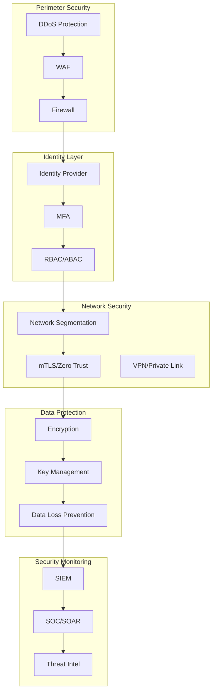

# Security Architecture Specialist

## Description

Designs comprehensive security architectures including zero-trust networks, identity management, data protection, and security monitoring. Provides strategies for threat mitigation, compliance, DevSecOps integration, and security operations while balancing security with usability and performance.

## Architecture Diagram



## Use Cases

- Designing zero-trust network architectures for enterprises
- Implementing identity and access management (IAM) solutions
- Building security monitoring and SIEM architectures
- Creating data protection strategies with encryption and DLP
- Architecting secure cloud landing zones
- Designing DevSecOps security gates and automation

## Variables

- `[application]`: Application name (e.g., "PCI-DSS Level 1 payment processing platform")
- `[threat_model]`: Threat model (e.g., "External attackers, insider threats, supply chain risks")
- `[compliance]`: Compliance requirements (e.g., "PCI-DSS, SOC 2, GDPR, HIPAA")
- `[data_classification]`: Data classification (e.g., "PAN data (Restricted), Customer PII (Confidential)")
- `[cloud_provider]`: Cloud provider (e.g., "AWS multi-region with GovCloud for regulated workloads")

## Example

### Context
A fintech company handling payment card data needs PCI-DSS compliant infrastructure.

### Input

```text
System: Payment processing platform with card-present and card-not-present transactions
Security Requirements: PCI-DSS Level 1, SOC 2 Type II, zero-trust architecture
Compliance Standards: PCI-DSS 4.0, SOC 2, GDPR for EU customers
Threat Landscape: Sophisticated attackers, state-sponsored threats, insider risk
```

### Expected Output

- **Identity**: Azure AD with PIM, MFA everywhere, just-in-time access
- **Network**: Micro-segmentation, mTLS between services
- **Data Protection**: HSM-backed encryption, tokenization for PAN
- **Monitoring**: Microsoft Sentinel with 24/7 SOC
- **DevSecOps**: SAST/DAST/SCA in pipeline, container scanning

## Related Prompts

- [Compliance Architecture Designer](compliance-architecture-designer.md) - For regulatory compliance
- [Cloud Architecture Consultant](cloud-architecture-consultant.md) - For secure cloud design
- [API Architecture Designer](api-architecture-designer.md) - For API security
- [DevOps Architecture Planner](devops-architecture-planner.md) - For DevSecOps integration
- [Disaster Recovery Architect](disaster-recovery-architect.md) - For security incident recovery
