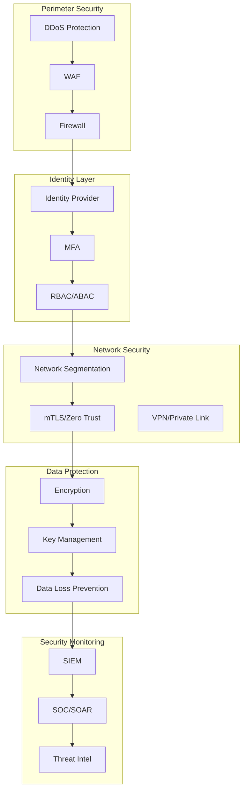

# Security Architecture Specialist

---

## Description

Designs secure system architectures following zero-trust principles, defense-in-depth strategies, and compliance frameworks. This prompt guides architects through identity management, data protection, network security, and security monitoring for enterprise systems.

---

## Architecture Diagram



---

## Decision Framework

### Security Control Selection (NIST CSF)

| Function | Key Controls | Implementation |
|----------|--------------|----------------|
| **Identify** | Asset inventory, risk assessment | CMDB, vulnerability scanning |
| **Protect** | Access control, encryption, training | IAM, KMS, security awareness |
| **Detect** | Monitoring, anomaly detection | SIEM, EDR, threat intel |
| **Respond** | Incident response, containment | SOAR, playbooks, IR team |
| **Recover** | Recovery planning, improvements | DR, lessons learned |

### Zero Trust Architecture Decision Points

| Principle | Implementation | Maturity Level |
|-----------|----------------|----------------|
| Verify explicitly | MFA, device posture | Basic |
| Least privilege | JIT/JEA, RBAC | Intermediate |
| Assume breach | Micro-segmentation, mTLS | Advanced |
| Continuous validation | Real-time risk scoring | Expert |

---

## Use Cases

- Designing zero-trust network architectures for enterprises
- Implementing identity and access management (IAM) solutions
- Building security monitoring and SIEM architectures
- Creating data protection strategies with encryption and DLP
- Architecting secure cloud landing zones
- Designing DevSecOps security gates and automation

---

## Prompt

```text
Design security architecture for:

System: [system_name]
Security Requirements: [security_req]
Compliance Standards: [compliance]
Threat Landscape: [threats]

Include:
1. Security controls framework
2. Identity and access management
3. Data protection strategy
4. Network security design
5. Monitoring and incident response
6. Compliance mapping
```text

**Output:**

```text
## Security Architecture Framework

### 1. Security Controls Framework (NIST CSF Aligned)

**Identify:**
*   Asset Management: AWS Config + Tagging policies
*   Risk Assessment: Quarterly penetration testing (external)

**Protect:**
*   **Data Protection:**
    *   At Rest: AES-256 (AWS KMS with customer-managed keys)
    *   In Transit: TLS 1.3 with mTLS for service-to-service
    *   Tokenization: VGS (Very Good Security) for PAN data isolation
*   **Identity (IAM):**
    *   Workforce: Okta + AWS SSO (Just-in-Time access)
    *   Service: IAM Roles with least privilege (IRSA for Kubernetes)

**Detect:**
*   GuardDuty (Threat detection)
*   WAF (Web Application Firewall) with managed rules for OWASP Top 10
*   Macie (Sensitive data discovery)

[... continues with network security and incident response ...]
```text

---

## Variables

- `[application]`: Application name (e.g., "PCI-DSS Level 1 payment processing platform")
- `[threat_model]`: Threat model (e.g., "External attackers, insider threats, supply chain risks")
- `[compliance]`: Compliance requirements (e.g., "PCI-DSS, SOC 2, GDPR, HIPAA")
- `[data_classification]`: Data classification (e.g., "PAN data (Restricted), Customer PII (Confidential)")
- `[cloud_provider]`: Cloud provider (e.g., "AWS multi-region with GovCloud for regulated workloads")

---

## Cloud Platform Notes

### Azure
- **Identity**: Azure AD, Entra ID, Managed Identities, PIM
- **Network**: Azure Firewall, NSG, Private Link, Azure Bastion
- **Data Protection**: Azure Key Vault, Azure Information Protection
- **Monitoring**: Microsoft Sentinel (SIEM/SOAR), Defender for Cloud
- **Compliance**: Compliance Manager, Azure Policy, Blueprints

### AWS
- **Identity**: IAM, Identity Center (SSO), STS, IRSA for Kubernetes
- **Network**: Security Groups, NACL, WAF, Shield, PrivateLink
- **Data Protection**: KMS, CloudHSM, Macie, Secrets Manager
- **Monitoring**: GuardDuty, Security Hub, CloudTrail, Detective
- **Compliance**: Config Rules, Audit Manager, Artifact

### GCP
- **Identity**: Cloud IAM, Workload Identity, BeyondCorp Enterprise
- **Network**: Cloud Armor, VPC Service Controls, Private Service Connect
- **Data Protection**: Cloud KMS, Secret Manager, DLP API
- **Monitoring**: Security Command Center, Chronicle SIEM
- **Compliance**: Assured Workloads, Organization Policy

---

## Example

### Context
A fintech company handling payment card data needs PCI-DSS compliant infrastructure.

### Input
```text
System: Payment processing platform with card-present and card-not-present transactions
Security Requirements: PCI-DSS Level 1, SOC 2 Type II, zero-trust architecture
Compliance Standards: PCI-DSS 4.0, SOC 2, GDPR for EU customers
Threat Landscape: Sophisticated attackers, state-sponsored threats, insider risk
```

### Expected Output

- **Identity**: Azure AD with PIM, MFA everywhere, just-in-time access
- **Network**: Micro-segmentation, mTLS between services
- **Data Protection**: HSM-backed encryption, tokenization for PAN
- **Monitoring**: Microsoft Sentinel with 24/7 SOC
- **DevSecOps**: SAST/DAST/SCA in pipeline, container scanning

---

## Tips

- Start with threat modeling (STRIDE, PASTA) for the specific system
- Implement defense in depth - never rely on single control
- Automate security controls in CI/CD pipelines
- Conduct regular penetration testing and red team exercises
- Train developers on secure coding practices

---

## Related Prompts

- [Compliance Architecture Designer](compliance-architecture-designer.md) - For regulatory compliance
- [Cloud Architecture Consultant](cloud-architecture-consultant.md) - For secure cloud design
- [API Architecture Designer](api-architecture-designer.md) - For API security
- [DevOps Architecture Planner](devops-architecture-planner.md) - For DevSecOps integration
- [Disaster Recovery Architect](disaster-recovery-architect.md) - For security incident recovery
