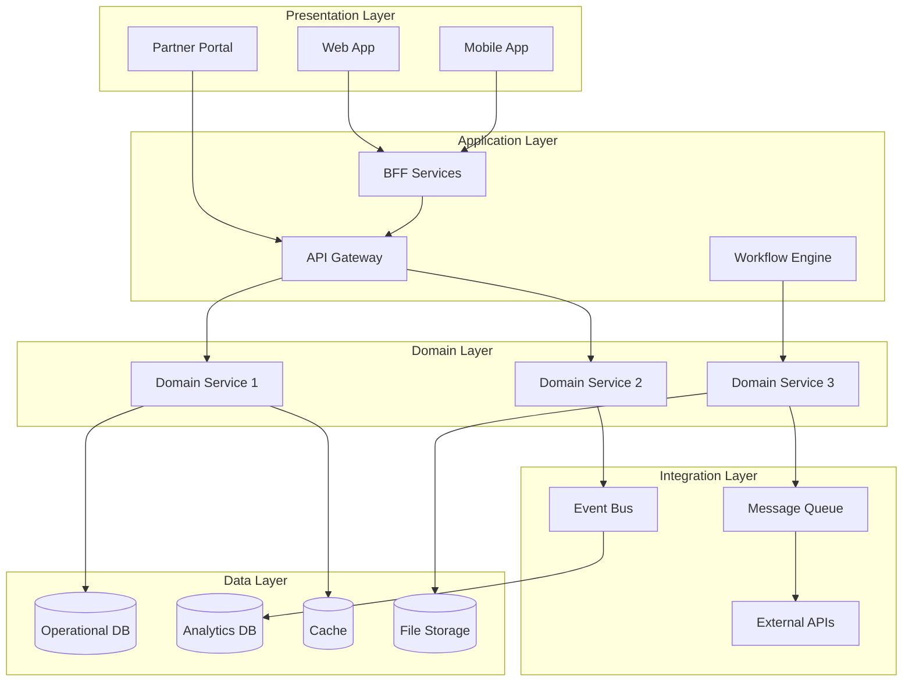

# Solution Architecture Designer

---

## Description

Designs comprehensive solution architectures that translate business requirements into technical designs. This prompt guides architects through component selection, integration patterns, technology stack decisions, and architectural trade-offs for enterprise solutions spanning multiple domains.

---

## Architecture Diagram



---

## Decision Framework

### Architecture Style Selection

| Style | When to Use | Trade-offs |
| ------- | ------------- | ------------ |
| **Monolith** | Small team, simple domain, fast MVP | Scaling limits, deployment coupling |
| **Modular Monolith** | Growing team, domain boundaries emerging | Discipline required, still coupled deploy |
| **Microservices** | Large teams, independent deployments needed | Complexity, distributed systems challenges |
| **Serverless** | Event-driven, variable load, pay-per-use | Cold starts, vendor lock-in |
| **Event-Driven** | Loose coupling, async processing, audit trails | Eventual consistency, debugging complexity |

### Technology Selection Criteria

| Factor | Weight | Considerations |
| -------- | -------- | ---------------- |
| Business fit | High | Does it solve the problem well? |
| Team expertise | High | Can we build and operate it? |
| Total cost | Medium | License, infrastructure, training |
| Ecosystem | Medium | Community, tooling, talent pool |
| Vendor support | Medium | Enterprise support, roadmap |
| Lock-in risk | Low-Medium | Migration difficulty, standards compliance |

---

## Use Cases

- Designing end-to-end e-commerce platforms with checkout flows
- Building customer engagement platforms with multi-channel support
- Creating SaaS product architectures with multi-tenancy
- Designing real-time analytics and dashboard solutions
- Building workflow automation and business process platforms
- Architecting customer-facing mobile and web applications

---

## Prompt

```text
Design solution architecture for:

Business Problem: [problem]
Functional Requirements: [functional_req]
Non-functional Requirements: [nonfunctional_req]
Constraints: [constraints]
Integration Needs: [integrations]

Provide:

1. High-level architecture diagram
2. Component specifications
3. Technology stack recommendations
4. Integration patterns
5. Scalability considerations
6. Security architecture

```text

**Output:**

```text
## High-Level Architecture

**Pattern:** Event-Driven Microservices on AWS

1.  **Frontend Layer:**
    *   CloudFront CDN for static assets
    *   React SPA hosted on S3
    *   BFF (Backend for Frontend) pattern using GraphQL (AppSync)

2.  **API Gateway Layer:**
    *   AWS API Gateway for request routing, throttling, and auth
    *   Cognito for customer identity management

3.  **Service Layer (Microservices):**
    *   **Product Service:** ECS Fargate (read-heavy, cached)
    *   **Order Service:** Lambda (burst scaling)
    *   **Inventory Service:** ECS Fargate (high consistency)
    *   **Recommendation Service:** SageMaker endpoint

4.  **Data Layer:**
    *   **Operational DB:** Aurora PostgreSQL (Orders, Customers)
    *   **Cache:** ElastiCache Redis (Sessions, Product Catalog)
    *   **Search:** OpenSearch (Product search)
    *   **Event Bus:** EventBridge for async decoupling (OrderPlaced -> InventoryUpdate)

[... continues with component specs and integration patterns ...]
```text

---

## Variables

- `[requirements]`: Business requirements (e.g., "E-commerce platform supporting 10M customers, Black Friday scale")
- `[constraints]`: Technical constraints (e.g., "AWS-only, existing Salesforce CRM integration, 99.99% SLA")
- `[timeline]`: Timeline (e.g., "MVP in 6 months, full launch in 12 months")
- `[stakeholders]`: Key stakeholders (e.g., "CTO, VP Engineering, Product team, External auditors")

---

## Cloud Platform Notes

### Azure

- **Compute**: App Service, Functions, Container Apps, AKS
- **Data**: Azure SQL, Cosmos DB, Azure Synapse
- **Integration**: Logic Apps, Service Bus, Event Grid
- **AI/ML**: Azure OpenAI, Cognitive Services, Azure ML
- **Frontend**: Azure Static Web Apps, CDN, Front Door

### AWS

- **Compute**: Lambda, ECS, EKS, App Runner
- **Data**: RDS, DynamoDB, Redshift, Aurora
- **Integration**: Step Functions, EventBridge, SQS/SNS
- **AI/ML**: Bedrock, SageMaker, Comprehend
- **Frontend**: Amplify, CloudFront, S3

### GCP

- **Compute**: Cloud Run, Cloud Functions, GKE
- **Data**: Cloud SQL, Firestore, BigQuery, Spanner
- **Integration**: Workflows, Pub/Sub, Eventarc
- **AI/ML**: Vertex AI, Document AI, Translation
- **Frontend**: Firebase Hosting, Cloud CDN

---

## Example

### Context
A retail company needs a customer engagement platform supporting personalization, loyalty programs, and omnichannel experiences across web, mobile, and in-store.

### Input

```text
Business Problem: Fragmented customer experience across channels, low loyalty engagement
Functional Requirements: Customer profiles, personalization engine, loyalty points, promotions
Non-functional Requirements: 99.9% availability, <500ms response, 10M customers, GDPR compliant
Constraints: AWS-only, 6-month timeline, $500k budget
Integration Needs: POS systems, mobile app, marketing automation (Braze), CRM (Salesforce)
```

### Expected Output

- **Architecture Pattern**: Event-Driven Microservices on AWS
- **Frontend**: React SPA on CloudFront, React Native mobile
- **API Layer**: AppSync GraphQL with BFF pattern
- **Services**: Customer Profile, Loyalty, Personalization, Promotions
- **Data**: Aurora PostgreSQL (operational), ElastiCache (sessions), OpenSearch (personalization)
- **Integration**: EventBridge for event-driven sync with Salesforce, Braze

---

## Tips

- Start with business capabilities, not technology choices
- Create multiple architecture options with trade-off analysis
- Use Architecture Decision Records (ADRs) for key decisions
- Validate architecture with proof-of-concepts for risky areas
- Consider operational aspects (monitoring, deployment) from day one

---

## Related Prompts

- [Cloud Architecture Consultant](cloud-architecture-consultant.md) - For cloud platform decisions
- [Microservices Architecture Expert](microservices-architecture-expert.md) - For service decomposition
- [API Architecture Designer](api-architecture-designer.md) - For API layer design
- [Data Architecture Designer](data-architecture-designer.md) - For data layer design
- [Security Architecture Specialist](security-architecture-specialist.md) - For security controls
- [Enterprise Integration Architect](enterprise-integration-architect.md) - For integration patterns
