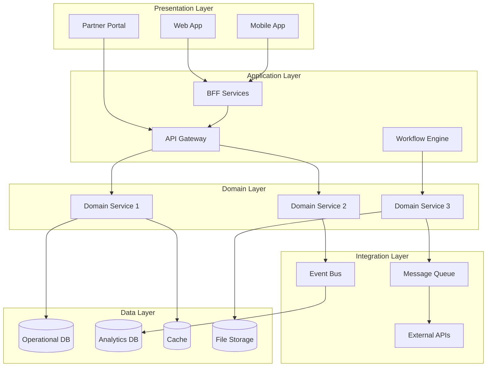

## Description

## Prompt



Designs comprehensive solution architectures

## Description

## Prompt


Designs comprehensive solution architectures


# Solution Architecture Designer

## Description

Designs end-to-end solution architectures for business applications including e-commerce, customer engagement, and SaaS platforms. Provides comprehensive technical specifications covering presentation, application, domain, integration, and data layers while addressing functional and non-functional requirements.

## Architecture Diagram


## Use Cases

- Designing end-to-end e-commerce platforms with checkout flows
- Building customer engagement platforms with multi-channel support
- Creating SaaS product architectures with multi-tenancy
- Designing real-time analytics and dashboard solutions
- Building workflow automation and business process platforms
- Architecting customer-facing mobile and web applications

## Variables

- `[requirements]`: Business requirements (e.g., "E-commerce platform supporting 10M customers, Black Friday scale")
- `[constraints]`: Technical constraints (e.g., "AWS-only, existing Salesforce CRM integration, 99.99% SLA")
- `[timeline]`: Timeline (e.g., "MVP in 6 months, full launch in 12 months")
- `[stakeholders]`: Key stakeholders (e.g., "CTO, VP Engineering, Product team, External auditors")

## Example

### Context
A retail company needs a customer engagement platform supporting personalization, loyalty programs, and omnichannel experiences across web, mobile, and in-store.

### Input

```text
Business Problem: Fragmented customer experience across channels, low loyalty engagement
Functional Requirements: Customer profiles, personalization engine, loyalty points, promotions
Non-functional Requirements: 99.9% availability, <500ms response, 10M customers, GDPR compliant
Constraints: AWS-only, 6-month timeline, $500k budget
Integration Needs: POS systems, mobile app, marketing automation (Braze), CRM (Salesforce)
```

### Expected Output

- **Architecture Pattern**: Event-Driven Microservices on AWS
- **Frontend**: React SPA on CloudFront, React Native mobile
- **API Layer**: AppSync GraphQL with BFF pattern
- **Services**: Customer Profile, Loyalty, Personalization, Promotions
- **Data**: Aurora PostgreSQL (operational), ElastiCache (sessions), OpenSearch (personalization)
- **Integration**: EventBridge for event-driven sync with Salesforce, Braze

## Related Prompts

- [Cloud Architecture Consultant](cloud-architecture-consultant.md) - For cloud platform decisions
- [Microservices Architecture Expert](microservices-architecture-expert.md) - For service decomposition
- [API Architecture Designer](api-architecture-designer.md) - For API layer design
- [Data Architecture Designer](data-architecture-designer.md) - For data layer design
- [Security Architecture Specialist](security-architecture-specialist.md) - For security controls
- [Enterprise Integration Architect](enterprise-integration-architect.md) - For integration patterns## Variables

_No bracketed variables detected._

## Example

### Input

````text
[Fill in a realistic input for the prompt]
````

### Expected Output

````text
[Representative AI response]
````
## Variables

| Variable | Description |
|---|---|
| `[(Analytics DB)]` | AUTO-GENERATED: describe `(Analytics DB)` |
| `[(Cache)]` | AUTO-GENERATED: describe `(Cache)` |
| `[(File Storage)]` | AUTO-GENERATED: describe `(File Storage)` |
| `[(Operational DB)]` | AUTO-GENERATED: describe `(Operational DB)` |
| `[API Architecture Designer]` | AUTO-GENERATED: describe `API Architecture Designer` |
| `[API Gateway]` | AUTO-GENERATED: describe `API Gateway` |
| `[Application Layer]` | AUTO-GENERATED: describe `Application Layer` |
| `[BFF Services]` | AUTO-GENERATED: describe `BFF Services` |
| `[Cloud Architecture Consultant]` | AUTO-GENERATED: describe `Cloud Architecture Consultant` |
| `[Data Architecture Designer]` | AUTO-GENERATED: describe `Data Architecture Designer` |
| `[Data Layer]` | AUTO-GENERATED: describe `Data Layer` |
| `[Domain Layer]` | AUTO-GENERATED: describe `Domain Layer` |
| `[Domain Service 1]` | AUTO-GENERATED: describe `Domain Service 1` |
| `[Domain Service 2]` | AUTO-GENERATED: describe `Domain Service 2` |
| `[Domain Service 3]` | AUTO-GENERATED: describe `Domain Service 3` |
| `[Enterprise Integration Architect]` | AUTO-GENERATED: describe `Enterprise Integration Architect` |
| `[Event Bus]` | AUTO-GENERATED: describe `Event Bus` |
| `[External APIs]` | AUTO-GENERATED: describe `External APIs` |
| `[Fill in a realistic input for the prompt]` | AUTO-GENERATED: describe `Fill in a realistic input for the prompt` |
| `[Integration Layer]` | AUTO-GENERATED: describe `Integration Layer` |
| `[Message Queue]` | AUTO-GENERATED: describe `Message Queue` |
| `[Microservices Architecture Expert]` | AUTO-GENERATED: describe `Microservices Architecture Expert` |
| `[Mobile App]` | AUTO-GENERATED: describe `Mobile App` |
| `[Partner Portal]` | AUTO-GENERATED: describe `Partner Portal` |
| `[Presentation Layer]` | AUTO-GENERATED: describe `Presentation Layer` |
| `[Representative AI response]` | AUTO-GENERATED: describe `Representative AI response` |
| `[Security Architecture Specialist]` | AUTO-GENERATED: describe `Security Architecture Specialist` |
| `[Web App]` | AUTO-GENERATED: describe `Web App` |
| `[Workflow Engine]` | AUTO-GENERATED: describe `Workflow Engine` |
| `[constraints]` | AUTO-GENERATED: describe `constraints` |
| `[requirements]` | AUTO-GENERATED: describe `requirements` |
| `[stakeholders]` | AUTO-GENERATED: describe `stakeholders` |
| `[timeline]` | AUTO-GENERATED: describe `timeline` |

## Example

### Input

````text
[Fill in a realistic input for the prompt]
````

### Expected Output

````text
[Representative AI response]
````

