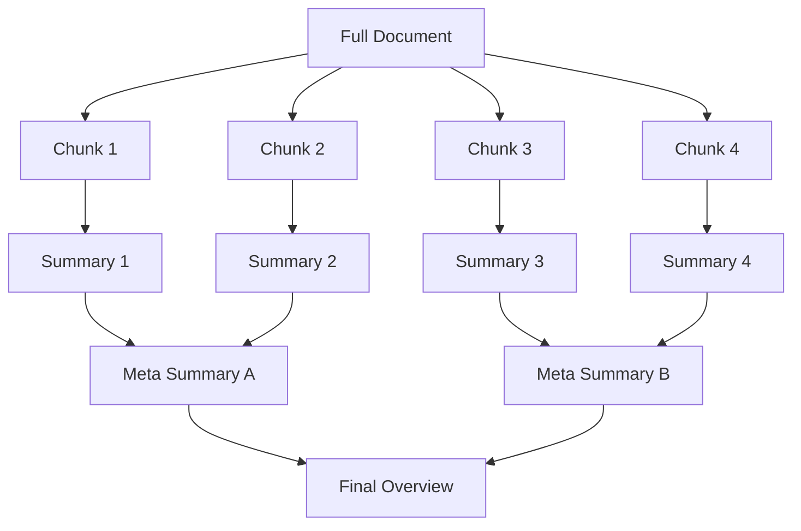

# Hierarchical Compression

## Purpose

Process extremely large documents (exceeding context limits) by recursively summarizing chunks and then summarizing the summaries, creating a "tree" of context.

## Overview

Hierarchical compression (or recursive summarization) allows you to digest content of arbitrary length (e.g., entire books, massive logs).

1. **Chunking**: Split text into manageable blocks (e.g., 4k tokens).
2. **Level 1 Summary**: Summarize each block.
3. **Level 2 Summary**: Summarize the combined Level 1 summaries.
4. **Root Summary**: The final high-level overview.

## Prompt

### Chunk Summary Prompt

```markdown
Summarize the following section of a larger document. Focus on the main arguments and key details.

**Section**:
{{chunk_text}}

**Summary**:
```

### High-Level Synthesis Prompt

```markdown
Combine the following summaries into a coherent high-level overview of the entire document.

**Summaries**:
{{summaries}}

**Overview**:
```

## Example

### Python Implementation

This example uses the `ContextOptimizer` class to apply hierarchical compression.

```python
from techniques.context_optimization.context_optimizer import ContextOptimizer

optimizer = ContextOptimizer()

# Massive text (simulated)
massive_text = "..." * 10000 

# Apply hierarchical compression
final_summary = optimizer.compress_context(
    text=massive_text,
    strategy="hierarchical",
    target_token_count=500
)

print(f"Final Summary: {final_summary}")
```

### Conceptual Flow



## Usage

### When to Use

- **Books/Papers**: "Summarize this 500-page PDF."
- **Codebase Understanding**: "Explain the architecture of this entire repository."
- **Long-Term Memory**: "What did we discuss over the last year?"

### When to Avoid

- **Needle in a Haystack**: If you need to find one specific fact (use RAG instead).
- **Short Texts**: Overkill for documents that fit in context.

## Best Practices

1. **Overlap**: Ensure chunks overlap by 10-20% to prevent context loss at boundaries.
2. **Metadata**: Pass metadata (chapter titles, file names) into the chunk summaries to maintain structure.
3. **Parallelization**: Level 1 summaries can be generated in parallel, significantly speeding up the process.
4. **Traceability**: Keep links back to the original chunks so users can "drill down" from the summary.
