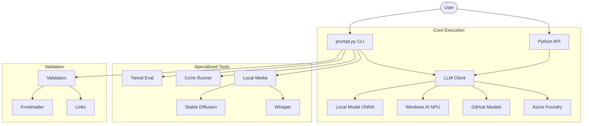
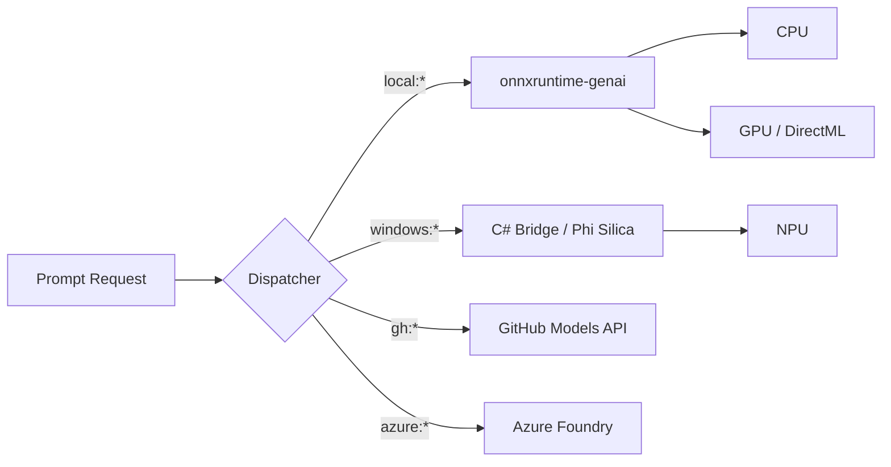

# Prompt Library Tools

**The canonical tooling location for the prompt library.** All evaluation, validation, and LLM utilities live here.

> **📦 Note**: `prompttools/` is deprecated - use this package instead. `toolkit/` has been archived.

Unified tooling for prompt execution, evaluation, validation, and multi-modal AI integration.

> **📋 Architecture**: See [ARCHITECTURE_PLAN.md](../docs/ARCHITECTURE_PLAN.md) for the complete tooling architecture.

### Tooling Ecosystem



---

---

## ⚡ One-Click Execution Matrix

Use these commands for common workflows. All models listed are pre-integrated into `llm_client.py`.

| Work Category | Use Case | Implementation Command | Best Model(s) |
| :--- | :--- | :--- | :--- |
| **Text Gen** | **Fastest Local** | `python prompt.py run <file> -p local -m phi4-cpu` | `phi4-cpu`, `phi3-cpu` |
| | **NPU / Copilot+** | `python prompt.py run <file> -p windows` | `phi-silica` |
| | **GPU Accelerated**| `python prompt.py run <file> -p local -m phi3-dml` | `phi3-dml`, `mistral-dml` |
| | **Cloud (GitHub)** | `python prompt.py run <file> -p gh -m gpt-4o-mini` | `gpt-4o-mini` |
| **Evaluation** | **Local Triage** | `python -m prompteval <dir> -t 0` | All Local ONNX |
| | **Local G-Eval** | `python -m prompteval <dir> -t 2` | `phi4`, `mistral` |
| | **Cross-Model** | `python -m prompteval <dir> -t 3` | GPT-4o, Phi4, Mistral |
| **Media Gen** | **Image Gen** | `python tools/local_media.py image "<prompt>"` | `stable-diffusion` |
| | **Speech-to-Text** | `python tools/local_media.py transcribe <audio>`| `whisper-small` |
| | **Upscale Image** | `python tools/local_media.py upscale <image>` | `esrgan` |
| **Fact-Check** | **Verify Claims** | `python prompt.py cove "<question>"` | `mistral`, `phi4-gpu` |
| **Maintenance**| **Library Audit** | `python tools/audit_prompts.py <dir>` | N/A |
| | **Schema Check** | `python tools/validators/frontmatter_validator.py --all`| N/A |

### 💡 Pro-Tips for Execution

- **Paths**: Use `<file>` for a single prompt (e.g., `prompts/basic/greeting.md`) or `<dir>` for bulk operations.
- **Providers**: `-p` can be `local`, `windows`, `gh`, `azure-foundry`, or `openai`.
- **Media**: `local_media.py` is a standalone tool—no API keys required for any media operations.
- **Windows AI**: Requires the Microsoft unlock token and a check for model availability (`python tools/windows_ai.py --info`).

---

## 📦 Core Components

### LLM Client (`llm_client.py`)

Unified dispatcher for all LLM providers. Routes requests based on model prefix.

| Prefix | Provider | Cost | Example |
| -------- | ---------- | ------ | --------- |
| `local:*` | Local ONNX (CPU/GPU) | $0 | `local:phi4-cpu` |
| `windows-ai:*` | Windows AI (NPU) | $0 | `windows-ai:phi-silica` |
| `gh:*` | GitHub Models | FREE tier | `gh:gpt-4o-mini` |
| `azure-foundry:*` | Azure Foundry | Pay-per-use | `azure-foundry:phi4mini` |
| `gpt-*` | OpenAI | Paid | `gpt-4o` |

### LLM Discovery & Routing



**Usage:**

```python
from tools.llm_client import LLMClient

# Local ONNX model
response = LLMClient.generate_text("local:phi4-cpu", "What is 2+2?")

# Windows AI (NPU)
response = LLMClient.generate_text("windows-ai:phi-silica", "Hello world")

# GitHub Models
response = LLMClient.generate_text("gh:gpt-4o-mini", "Explain recursion")
```

---

### Local Models (`local_model.py`)

Direct interface for local ONNX models via `onnxruntime-genai`.

**Available Models (28 total):**

| Key | Model | Params | Hardware |
| ----- | ------- | -------- | ---------- |
| `phi4` / `phi4-cpu` | Phi-4 Mini | 3.8B | CPU |
| `phi4-gpu` | Phi-4 Mini | 3.8B | GPU |
| `phi3.5` / `phi3.5-cpu` | Phi-3.5 Mini | 3.8B | CPU |
| `phi3` / `phi3-cpu` | Phi-3 Mini | 3.8B | CPU |
| `phi3-dml` | Phi-3 Mini | 3.8B | GPU (DirectML) |
| `phi3-medium` | Phi-3 Medium | 14B | CPU |
| `phi3-medium-dml` | Phi-3 Medium | 14B | GPU |
| `mistral` / `mistral-cpu` | Mistral 7B | 7B | CPU |
| `mistral-dml` | Mistral 7B | 7B | GPU |
| `phi3-vision` | Phi-3 Vision | 4.2B | CPU |
| `phi3.5-vision` | Phi-3.5 Vision | 4.2B | CPU |

**Usage:**

```python
from tools.local_model import LocalModel

model = LocalModel(verbose=True)
response = model.generate("What is machine learning?", max_tokens=500)
```

**Evaluation Methods (all FREE with local models):**

| Method | Description | Best For |
| -------- | ------------- | ---------- |
| `evaluate_prompt()` | Direct 6-criteria scoring | Fast evaluation |
| `evaluate_prompt_geval()` | G-Eval with Chain-of-Thought | Explainable scoring |
| `evaluate_prompt_dual()` | Both methods combined | Most robust evaluation |

```python
from tools.local_model import LocalModel

model = LocalModel()
content = open("prompts/example.md").read()

# Direct scoring (6 criteria)
result = model.evaluate_prompt(content)
print(f"Score: {result['overall']}")

# G-Eval with CoT reasoning (NeurIPS 2023)
result = model.evaluate_prompt_geval(content)
print(f"Score: {result['overall']}, Reasoning: {result['criteria_results']}")

# Dual evaluation (both methods combined)
result = model.evaluate_prompt_dual(content)
print(f"Combined Score: {result['combined_score']}")
```

---

### Windows AI (`windows_ai.py`)

NPU-accelerated inference via Windows Copilot Runtime (Phi Silica).

**Requirements:**

- Windows 11 24H2+ with Copilot+ PC
- AMD Ryzen AI / Intel Core Ultra / Qualcomm Snapdragon X NPU
- Microsoft unlock token (Limited Access Feature)

**Usage:**

```python
from tools.windows_ai import WindowsAIModel

model = WindowsAIModel(verbose=True)
response = model.generate("Explain quantum computing")
```

**CLI:**

```bash
python prompt.py run prompts/example.md -p windows
```

---

### Local Media (`local_media.py`)

Multi-modal AI: image generation, speech-to-text, and image upscaling.

**Image Generation (Stable Diffusion):**

```bash
python tools/local_media.py image "A sunset over mountains" -o sunset.png
python tools/local_media.py image "Cyberpunk city" --width 768 --height 512 --steps 75
```

**Speech-to-Text (Whisper):**

```bash
python tools/local_media.py transcribe recording.wav -o transcript.txt
python tools/local_media.py transcribe audio.mp3 --model medium --language en
```

**Image Upscaling (ESRGAN):**

```bash
python tools/local_media.py upscale low_res.png -o high_res.png
```

**Python API:**

```python
from tools.local_media import generate_image, transcribe_audio, upscale_image

# Generate image
generate_image("A cat wearing a hat", output_path="cat.png")

# Transcribe audio
text = transcribe_audio("meeting.wav", model_size="small")

# Upscale image
upscale_image("photo.jpg", output_path="photo_4x.png")
```

---

## 🔍 Evaluation Tools

### PromptEval (`prompteval`)

 The unified tool for all evaluation needs. Replaces `tiered_eval.py`, `evaluate_library.py`, and `batch_evaluate.py`.

 ```bash
 # Local G-Eval (Tier 2 - Free)
 python -m prompteval prompts/advanced/

 # Cross-model validation (Tier 3)
 python -m prompteval prompts/ --tier 3

 # Specific models
 python -m prompteval prompt.md -m phi4,gpt-4o-mini

 # CI/CD mode
 python -m prompteval prompts/ --ci
 ```

---

## ✅ Validation Tools

### Frontmatter Validator (`validators/frontmatter_validator.py`)

Validates YAML frontmatter against metadata schema.

```bash
python tools/validators/frontmatter_validator.py --all
python tools/validators/frontmatter_validator.py prompts/developers/
```

### Prompt Auditor (`audit_prompts.py`)

Generates CSV audit report for prompt migration/validation.

```bash
python tools/audit_prompts.py prompts/ --output audit_report.csv
```

### Link Checker (`check_links.py`)

Validates internal documentation links.

```bash
python tools/check_links.py docs/
```

---

## 📊 Improvement Tools

### Prompt Improver (`improve_prompts.py`)

AI-powered improvement recommendations.

```bash
python prompt.py improve prompts/basic/
python tools/improve_prompts.py prompts/advanced/react-pattern.md
```

---

## 📁 Directory Structure

```text
tools/
├── README.md                      # This file
├── prompteval/                    # ✅ NEW: Unified Evaluation Tool
├── # ═══ Core LLM Integration ═══
├── llm_client.py                  # Unified LLM dispatcher
├── local_model.py                 # Local ONNX model runner
├── windows_ai.py                  # Windows AI (NPU) integration
├── local_media.py                 # Image/Audio multi-modal
│
├── # ═══ Other Tools ═══
├── cove_runner.py                 # Chain-of-Verification (single run)
├── evaluation_agent.py            # Autonomous eval agent
├── improve_prompts.py             # Improvement recommendations
│
├── # ═══ Validation ═══
├── validators/
│   ├── frontmatter_validator.py   # Schema validation
│   └── prompt_validator.py        # Content validation
├── check_links.py                 # Link checker
│
├── # ═══ Testing ═══
├── test_*.py                      # Tool unit tests
├── tests_README.md                # Test documentation
│
└── archive/                       # Deprecated tools (tiered_eval, etc.)
```

---

## 🔧 Configuration

### Environment Variables

| Variable | Purpose | Default |
| ---------- | --------- | --------- |
| `GITHUB_TOKEN` | GitHub Models API | Required for `gh:*` |
| `AZURE_OPENAI_ENDPOINT` | Azure Foundry | Required for `azure-foundry:*` |
| `AZURE_OPENAI_KEY` | Azure Foundry | Required for `azure-foundry:*` |
| `OPENAI_API_KEY` | OpenAI API | Required for `gpt-*` |

### Model Cache Location

Local ONNX models are cached in:

```
~/.cache/aigallery/
```

---

## 📚 See Also

- [UNIFIED_TOOLING_GUIDE.md](../docs/UNIFIED_TOOLING_GUIDE.md) - Complete tooling guide
- [WINDOWS_AI_INSTALL.md](../WINDOWS_AI_INSTALL.md) - Windows AI setup
- [CLI_TOOLS.md](../docs/CLI_TOOLS.md) - CLI reference
- [ARCHITECTURE_PLAN.md](../docs/ARCHITECTURE_PLAN.md) - Architecture overview

---

## 🆘 Troubleshooting

### "No local model found"

```bash
# Check AI Gallery cache
ls ~/.cache/aigallery/

# Specify model explicitly
python prompt.py run example.md -p local -m phi4-cpu
```

### "Windows AI access denied"

Windows AI (Phi Silica) is a Limited Access Feature. Apply for unlock token at:
<https://aka.ms/phi-silica-unlock>

### "onnxruntime-genai not installed"

```bash
pip install onnxruntime-genai
# Or for GPU:
pip install onnxruntime-genai-directml
```
